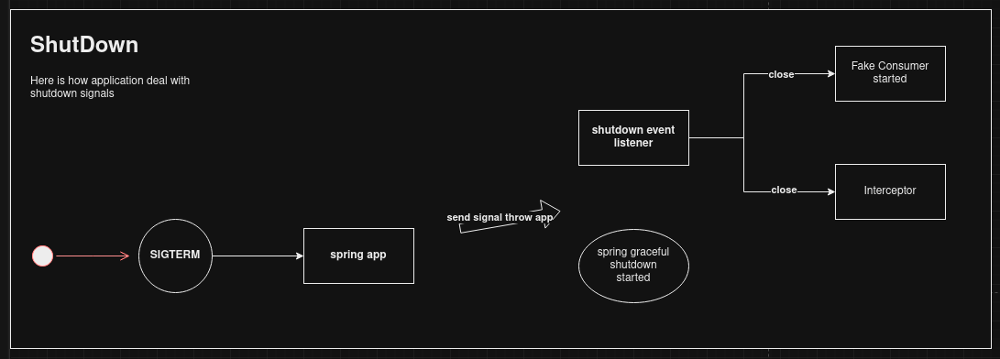

## Spring Java 11 - Graceful shutdown POC

This POC intent to implement a way of shut down application following some rules.

### Rules

* Given application has received a SIGTERM or SIGINT signal all API endpoints become unavailable for new requests. Only remaining processes can be delivered after that.
* Some processes such Consumers SQS or Redis must be ended too given scenario above.
* Producers or delivering APIS must keep working to finish remaining tasks 'til application KILL signal.

### Flow

#### Launching app

**Explanation**:
When spring application start, fake consumers and producers start to simulate and APIs resources become available.

#### Using API

**Explanation**:
While application is running, users can achieve resources without problems. Interceptor act as a middleware to validate endpoint availability.

#### Shut down

**Explanation**:
Once the application has received sigterm or sigint, some processes such fake consumer and API must be finalized to avoid usage. Only process that finish remaining tasks must keep working to clean any pending action inside finishing app. After 30s, everything will be stopped and application will be killed. 

### How to use it

**Launching app**: Using Intellij: shift + f10
**Stopping app**: kill -15 <pid>